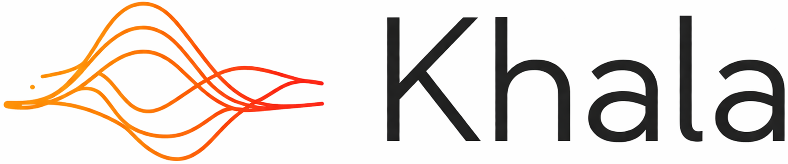
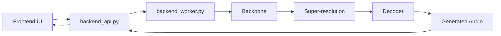

<div align="center">



# High-Fidelity Song Generation With a Unified Acoustic-Token Pipeline

[English](./README.md) | 中文

</div>

<div align="center">

Khala 是一个面向高保真歌曲生成的开源系统，提供从文本条件到音频生成的完整推理链路，包括前端界面、后端调度、多阶段模型推理，以及可复现的运行环境。

</div>

<div align="center">

<a href="<demo-page-link>">
  
</a>
<a href="<arxiv-link>">
  
</a>
<a href="<huggingface-model-link>">
  
</a>
<a href="./ENVIRONMENT_SETUP_zh.md">
  
</a>
<a href="./backend/README_backend_zh.md">
  
</a>

</div>

## ✨ What Is Khala

Khala 旨在提供一个尽可能完整、可运行、可扩展的“准商业体验”的歌曲生成系统实现，而不仅仅是若干离散的推理脚本。整个系统围绕统一的 acoustic-token 路线构建，在同一套离散音频表示空间内完成从粗粒度结构到细粒度声学细节的逐步生成。

当前版本包含以下核心部分：

- 一个基于 Vite + React 的前端界面，用于输入 prompt、lyrics 和生成参数。
- 一个基于 FastAPI 的后端调度层，用于接收前端请求、管理队列、调度 worker，并回传生成结果。
- 一个单卡推理 worker，用于加载 tokenizer、Megatron backbone、super-resolution 模型和 decoder，执行完整音频生成链路。
- 一套围绕 NVIDIA NGC 容器整理过的运行环境配置方式，便于复现与后续部署。

当前项目重点关注：

- 歌曲级别的音乐生成，而不仅仅是短音频片段或伴奏循环。
- 基于文本描述与歌词条件的可控生成。
- 基于 64 层 RVQ acoustic token hierarchy 的 coarse-to-fine generation。
- 使用 backbone、super-resolution 和 decoder 组成的多阶段推理链路。
- 提供完整可运行系统，而不是单独的模型推理脚本。

## 📰 News

- `[2026-04-30]` Demo 页面与论文页面已上线。
- `[2026-04-30]` 当前版本代码、环境文档与 Dockerfile 已整理完成。
- `[Coming Soon]` 预构建 Docker 镜像将发布到 GHCR。
- `[Coming Soon]` 更多音频样例与模型版本将逐步补充。

### 🖥️ Web UI


### 🎧 Audio Samples

完整音频样例页面见：

- [Listen to Khala Demos](<demo-page-link>)

## 🚀 Quick Start

推荐启动路径如下：

1. 克隆本仓库。
2. 准备运行环境。
3. 下载模型 checkpoint。
4. 将模型文件放到项目要求的位置。
5. 启动后端与前端。

当前支持两种环境准备方式：

- 使用预构建 Docker 镜像。
- 使用仓库根目录的 [Dockerfile](./Dockerfile) 或 [环境配置文档](./ENVIRONMENT_SETUP_zh.md) 手动准备环境。

详细文档入口：

- 环境配置：
  - [ENVIRONMENT_SETUP_zh.md](./ENVIRONMENT_SETUP_zh.md)
  - [ENVIRONMENT_SETUP.md](./ENVIRONMENT_SETUP.md)
- 后端说明：
  - [backend/README_backend_zh.md](./backend/README_backend_zh.md)
  - [backend/README_backend.md](./backend/README_backend.md)

## 🧠 System Overview

当前系统由三层组成：

- 前端：负责输入 prompt、lyrics 和生成参数，并展示结果。
- API 调度层：负责接收请求、创建任务、排队并分发到空闲 worker。
- Worker 推理层：负责执行 backbone、super-resolution 和 decoder 推理。

请求链路如下：



## 🔗 Project Resources

- Demo 页面：`<demo-page-link>`
- arXiv 论文：`<arxiv-link>`
- 模型权重：`<huggingface-model-link>`
- 环境配置：[ENVIRONMENT_SETUP_zh.md](./ENVIRONMENT_SETUP_zh.md)
- 后端说明：[backend/README_backend_zh.md](./backend/README_backend_zh.md)

## 🗂 Repository Structure

```text
Khala-Music-Generation/
├── backend/
├── frontend/
├── core/
├── models/
├── checkpoints/
├── assets/
├── Dockerfile
├── requirements.txt
├── ENVIRONMENT_SETUP.md
└── ENVIRONMENT_SETUP_zh.md
```

主要目录说明：

- `frontend/`：前端页面与 Vite 工程。
- `backend/`：后端 API、worker 和启动脚本。
- `core/`：项目自定义核心模块。
- `models/`：Megatron、decoder 和 tokenizer 相关代码。
- `checkpoints/`：模型权重文件目录。
- `assets/`：README 与展示页面使用的图片资源。


## 📚 Citation

引用信息将在后续补充。

## 🙏 Acknowledgements

本项目当前实现建立在若干优秀开源项目与工具之上，包括但不限于：

- NVIDIA NGC
- Megatron / Megatron Core
- Hugging Face
- FastAPI
- Vite / React

## 📜 License

许可证信息将在后续补充。
