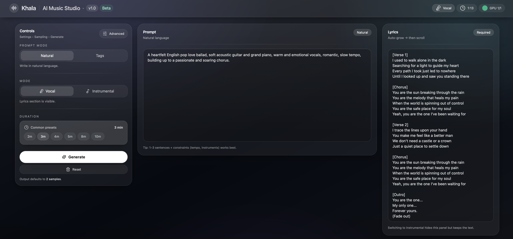
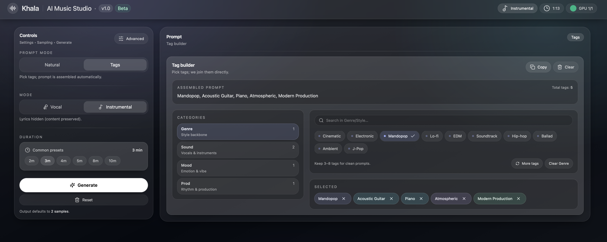
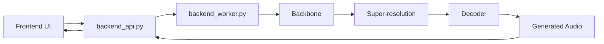

# Khala

[English](./README.md) | 中文

Khala 是一个面向歌曲生成的开源音乐生成系统，提供从文本条件到音频生成的完整推理链路，包括前端界面、后端调度、多阶段模型推理，以及可复现的运行环境说明。

> [!IMPORTANT]
> 当前仓库已经提供完整代码、环境文档和 Dockerfile。
> 预构建 Docker 镜像、模型下载入口、论文链接与音频 Demo 页面将在后续补充。

## 项目亮点

- 支持完整的前后端联调体验，而不仅仅是单独的推理脚本。
- 采用多阶段推理链路，包括 backbone、super-resolution 和 decoder。
- 提供可运行的 Web 界面，方便本地测试和后续演示。
- 提供基于 NVIDIA NGC 的环境配置方式，便于复现。
- 项目结构已经整理到适合公开发布和继续迭代的状态。

## Demo

### Web UI

当前前端界面如下：





### Audio Samples

音频 Demo 页面将在后续补充。

## News

- `[2026-04-21]` 初始开源版本仓库整理完成，当前版本包含前端、后端、环境文档与 Dockerfile。
- `[Coming Soon]` 预构建 Docker 镜像发布。
- `[Coming Soon]` Hugging Face 模型 checkpoint 下载说明补充。
- `[Coming Soon]` 论文与引用信息补充。

## 项目简介

Khala 旨在提供一个尽可能完整、可运行、可扩展的歌曲生成系统实现，而不是仅仅提供若干离散的推理脚本。

当前版本包含以下核心部分：

- 一个基于 Vite + React 的前端界面，用于输入 prompt、lyrics 和生成参数。
- 一个基于 FastAPI 的后端调度层，用于接收前端请求、管理队列、调度 worker，并回传生成结果。
- 一个单卡推理 worker，用于加载 tokenizer、Megatron backbone、super-resolution 模型和 decoder，执行完整音频生成链路。
- 一套围绕 NVIDIA NGC 容器整理过的环境配置方式，方便后续制作 Docker 镜像并公开发布。

## 快速开始

当前推荐有两种运行方式：

1. 使用仓库根目录的 [Dockerfile](./Dockerfile) 构建环境镜像。
2. 按照环境文档手动配置一个干净的 NGC 容器。

最短启动路径如下：

1. 克隆本仓库。
2. 准备运行环境。
3. 下载模型 checkpoint 并放到仓库要求的位置。
4. 启动后端。
5. 启动前端。

相关文档入口：

- 环境配置：
  - [ENVIRONMENT_SETUP_zh.md](./ENVIRONMENT_SETUP_zh.md)
  - [ENVIRONMENT_SETUP.md](./ENVIRONMENT_SETUP.md)
- 后端说明：
  - [backend/README_backend_zh.md](./backend/README_backend_zh.md)
  - [backend/README_backend.md](./backend/README_backend.md)

## 模型权重

模型 checkpoint 下载入口将在后续补充。

当前默认代码会从仓库根目录下的 `checkpoints/` 读取模型文件。使用时请确保下载后的模型文件结构与项目说明保持一致。

## 系统结构

当前系统由三层组成：

- 前端：负责输入 prompt、lyrics 和参数，并展示生成结果。
- API 调度层：负责接收请求、创建任务、排队、分发到空闲 worker。
- Worker 推理层：负责真正执行 backbone、super-resolution 和 decoder 推理。

请求链路大致如下：



## 仓库结构

```text
Khala-Music-Generation/
├── backend/
├── frontend/
├── core/
├── models/
├── checkpoints/
├── Dockerfile
├── requirements.txt
├── ENVIRONMENT_SETUP.md
└── ENVIRONMENT_SETUP_zh.md
```

主要目录说明：

- `backend/`：后端 API、worker 和启动脚本。
- `frontend/`：前端页面与 Vite 工程。
- `core/`：项目自定义核心模块。
- `models/`：Megatron、decoder 和 tokenizer 相关代码。
- `checkpoints/`：模型权重文件目录。

## Roadmap

- [ ] 发布预构建 Docker 镜像
- [ ] 补充模型 checkpoint 下载与放置说明
- [ ] 补充音频 Demo
- [ ] 补充论文链接与引用信息
- [ ] 测试并整理多 GPU / 多 worker 运行说明
- [ ] 持续优化前后端代码结构与部署体验

## 论文

论文链接将在后续补充。

## Citation

引用信息将在后续补充。

## Acknowledgements

本项目当前实现建立在若干优秀开源项目与工具之上，包括但不限于：

- NVIDIA NGC
- Megatron / Megatron Core
- Hugging Face
- FastAPI
- Vite / React

## License

许可证信息将在后续补充。
